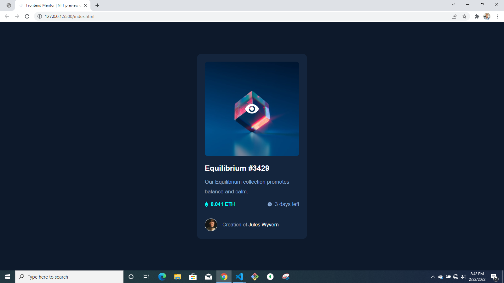

# Frontend Mentor - NFT preview card component solution

This is a solution to the [NFT preview card component challenge on Frontend Mentor](https://www.frontendmentor.io/challenges/nft-preview-card-component-SbdUL_w0U). Frontend Mentor challenges help you improve your coding skills by building realistic projects.

## Table of contents

- [Overview](#overview)
  - [The challenge](#the-challenge)
  - [Screenshot](#screenshot)
  - [Links](#links)
- [My process](#my-process)
  - [Built with](#built-with)
  - [What I learned](#what-i-learned)
  - [Useful resources](#useful-resources)
- [Author](#author)
- [Acknowledgments](#acknowledgments)

## Overview

An NFT preview card component built with HTML and styled with Sass/scss.

### The challenge

Users should be able to:

- View the optimal layout depending on their device's screen size
- See hover states for interactive elements

### Screenshot

### Links

- Solution URL: [Add solution URL here](https://your-solution-url.com)
- Live Site URL: [Add live site URL here](https://your-live-site-url.com)

## My process

- Add the HTML elemnts
- Add styling
- Final touches

### Built with

- Semantic HTML5 markup
- CSS custom properties
- Flexbox
- Sass/Scss

### What I learned

- use of HTML semantic tags

### Useful resources

- [Traversy Media - Flexbox Crash Course](https://www.youtube.com/watch?v=3YW65K6LcIA) - This resource was really helpful in grasping the basics of flexbox. I really liked this pattern and will use it going forward.
- [Traversy Media - Sass Crash Course](https://www.youtube.com/watch?v=nu5mdN2JIwM&t=424s) - Splendid tutorial for getting in into sass. I'd recommend it to anyone still learning this concept.

## Author

- Website - [Add your name here](https://www.your-site.com)
- Frontend Mentor - [@nuelobeto](https://www.frontendmentor.io/profile/nuelobeto)

## Acknowledgments

Kudos to ((https://www.frontendmentor.io) for provide such an amazing platform for budding and experienced developers alike to hone and grow their skills. Truly magnificent!
A big thank you to content creators who selflessly provide tutorials and resources for learning.
